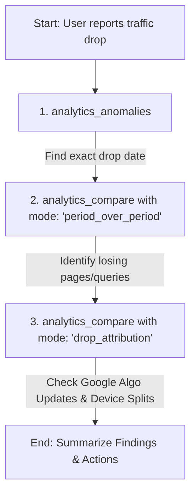

# Search Console MCP — Agent Skill Guide

This document is the definitive operational reference for AI agents (LLMs) interacting with the `search-console-mcp` server v2.0.

---

## 🧠 1. Agent Mental Model & Core Concepts

To prevent failures, data gaps, or validation errors when invoking tools, you must internalize these rules:

### A. Fluent Domain Architecture (v2.0)
Search Console MCP v2.0 organizes tools into **7 Fluent Domain Modules**:
* `sites_list` / `sites_manage` / `accounts_manage` — Site property & multi-account configuration
* `sitemaps_list` / `sitemaps_submit` / `sitemaps_delete` — Sitemap management across GSC & Bing
* `analytics_query` / `analytics_compare` / `analytics_anomalies` — Search analytics, period comparisons, drop attribution & trends
* `inspection_inspect` / `pagespeed_analyze` — URL inspection & PageSpeed Insights audits
* `indexing_submit` / `indexing_status` — URL indexing (Standard, IndexNow, Removal)
* `seo_audit` / `seo_keywords_research` / `schema_validate` — SEO opportunities (Quick Wins, Striking Distance, Cannibalization, Low Hanging Fruit, Lost Queries)
* `site_health_check` / `compare_engines` — Cross-platform summary, crawl issue audits & engine comparisons

> **Note on Backward Compatibility**: All legacy tool names (`bing_sites_list`, `seo_quick_wins`, `sitemaps_get`, `bing_index_now`, etc.) continue to work transparently via the internal fallback router. However, agents should prefer Fluent Domain tool calls for cleaner parameterization and lower context overhead.

### B. Parallel Fetch (`engine: "all"`)
When invoking multi-engine operations (`sites_list`, `sitemaps_list`, `analytics_query`, `site_health_check`, `seo_audit`), specify `engine: "all"` to fetch data concurrently across Google, Bing, and GA4 with **50%+ lower latency**.

### C. The 2-3 Day Data Delay (Google Search Console)
Google Search Console data is **never real-time**; it lags by **2 to 3 days**. 
* **Rule**: When querying `analytics_query`, `analytics_compare`, or running time-series analysis, **never use today's or yesterday's date as the end date**. 
* **Default Range**: Always query using a range ending at least 3 days ago (e.g., if today is July 15, set the end date to July 12 or earlier).
* **Exception**: GA4 tools (`analytics_realtime` and standard GA4 metrics) support real-time/today query dates.

---

## 🔌 2. Multi-Tool Workflow Recipes

### Recipe A: Traffic Drop Attribution & Algorithm Correlation
When a user asks: *"Why did my traffic drop recently?"*

1. **Find the Anomaly**: Call `analytics_anomalies({ siteUrl })` to locate the exact date when the statistical drop began.
2. **Compare Periods**: Call `analytics_compare({ siteUrl, mode: "period_over_period" })` comparing post-drop vs. pre-drop to list losing pages and queries.
3. **Attribute & Correlate**: Call `analytics_compare({ siteUrl, mode: "drop_attribution" })` for the drop date. This checks device-type split loss and cross-references known Google Search Algorithm Updates (such as Core or Spam updates) to determine root cause.

### Recipe B: Comprehensive SEO Audit
To audit domain SEO performance:
1. Call `seo_audit({ siteUrl, type: "quick_wins" })` for position 8–15 high impression queries.
2. Call `seo_audit({ siteUrl, type: "cannibalization" })` for competing pages.
3. Call `seo_audit({ siteUrl, type: "low_hanging_fruit" })` for low CTR queries.
4. Call `site_health_check({ siteUrl, level: "full" })` for technical crawl health and sitemap validation.

---

## 🛠 3. Diagnostic & CLI Reference

| Goal | Command |
|---|---|
| Run setup wizard | `npx search-console-mcp setup` |
| List connected credentials | `npx search-console-mcp accounts list` |
| Execute tool directly from CLI | `npx search-console-mcp run analytics_query --siteUrl=https://example.com --format=table` |
| Run full SEO audit via CLI | `npx search-console-mcp run seo_audit --siteUrl=https://example.com --type=quick_wins` |
