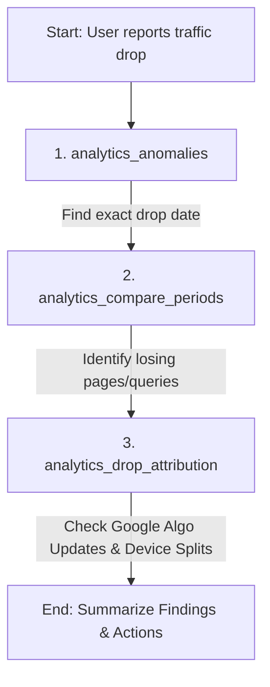

# Search Console MCP — Agent Skill Guide

This document is the definitive operational reference for AI agents (LLMs) interacting with the `search-console-mcp` server. It provides cognitive models, troubleshooting diagnostics, rate-limiting guidelines, and multi-tool workflow recipes.

---

## 🧠 1. Agent Mental Model & Core Concepts

To prevent failures, data gaps, or validation errors when invoking tools, you must internalize these rules:

### A. The 2-3 Day Data Delay (Google Search Console)
Google Search Console data is **never real-time**; it lags by **2 to 3 days**. 
* **Rule**: When querying `analytics_query`, `analytics_trends`, or running time-series analysis, **never use today's or yesterday's date as the end date**. 
* **Default Range**: Always query using a range ending at least 3 days ago (e.g., if today is July 15, set the end date to July 12 or earlier).
* **Exception**: GA4 tools (`analytics_realtime` and standard GA4 metrics) support real-time/today query dates.

### B. Property Matching: URL-Prefix vs. Domain Properties
Google Search Console differentiates between:
* **URL-Prefix Properties** (e.g., `https://example.com/`): Must include the trailing slash and exact protocol.
* **Domain Properties** (e.g., `sc-domain:example.com`): Covers all subdomains and protocols.
* **Rule**: When querying performance or inspecting URLs, use `sites_list` to fetch the exact verified string first. If the user asks you to audit `example.com`, check if the registered GSC property is `sc-domain:example.com` or `https://example.com/` and pass the *exact registered name* to `siteUrl` arguments.

### C. Multi-Account Resolution
The server handles OAuth tokens and API keys transparently. 
* If a query fails with access errors, list the registered sites using `sites_list` to verify if the site is authorized under any of the connected accounts.

---

## ⚡ 2. Quotas & Rate-Limit Strategies

### A. PageSpeed Insights API Limits
The `pagespeed_analyze` tool supports two levels of throughput:
* **Keyless (Free Tier)**: Limited to **~100 queries/day** and **~1 query/second**. Highly prone to `429` (Rate Limit) errors under batch conditions.
* **With API Key (`PAGESPEED_API_KEY`)**: Unlocks **25,000 queries/day** and **~4 queries/second**.
* **Agent Strategy**: 
  1. If you encounter a `429` error on the free tier, instruct the user to configure `PAGESPEED_API_KEY` (either in their `.env` file or client settings).
  2. When auditing multiple pages concurrently (e.g., correlating pagespeed with landing pages), **throttle execution** to a maximum of **5 parallel calls** to prevent quota exhaustion.

### B. Google Indexing API Constraints
* **Scope**: The Google Indexing API is strictly meant for pages containing `JobPosting` or `BroadcastEvent` structured markup.
* **Agent Strategy**: Before submitting a URL to `indexing_submit_url`, run `schema_validate` or inspect the page to confirm it contains the supported schemas. Warn the user if it does not, as Google may ignore submissions for unsupported content types.

---

## 🔌 3. Multi-Tool Workflow Recipes

Combine these tools to deliver premium-grade SEO audits without leaving the context window.

### Recipe A: Traffic Drop Attribution & Algorithm Correlation
When a user asks: *"Why did my traffic drop recently?"*

1. **Find the Anomaly**: Call `analytics_anomalies` to locate the exact date when the statistical drop began.
2. **Compare Periods**: Call `analytics_compare_periods` comparing the post-drop period vs. the pre-drop period (e.g., 7 days WoW or 28 days MoM) to list the losing pages and queries.
3. **Attribute & Correlate**: Call `analytics_drop_attribution` for the drop date. This will run device-type split checks and cross-reference known search algorithm updates (such as Google Core or Spam Updates) during that timeframe to tell the user if they were hit by an algorithm change.

### Recipe B: The Opportunity Matrix (Search Visibility + GA4 ROI)
To prioritize content optimization by combining rankings with real user engagement:
1. Call `opportunity_matrix` for the domain.
2. This combines GSC clicks/impressions with GA4 engagement rate, sessions, and conversion data.
3. **Analyze**: Identify pages with high impressions/rankings but low GA4 conversion or engagement. These are "conversion rate optimization (CRO)" candidates. Identify pages with high GA4 conversion rates but low GSC impressions; these are "high-potential SEO boosts" (needs more links/authority).

### Recipe C: Keyword Cannibalization Cleanup
To find pages competing against each other and dragging down rankings:
1. Call `seo_cannibalization` for the domain.
2. The tool analyzes queries receiving impressions across multiple landing pages and flags splits.
3. **Resolution**: Recommend setting up 301 redirects, consolidation of content, or configuring proper canonical tags to favor the primary URL suggested by the tool.

### Recipe D: Striking Distance & CTR Optimization
To find quick organic traffic wins:
1. Call `seo_striking_distance` to find keywords ranking in positions 8–15 with high impressions. (These are sitting on page 2 / bottom of page 1 and can easily be pushed up).
2. Call `seo_low_ctr_opportunities` to isolate high-ranking keywords (positions 1–10) that have a lower-than-average click-through rate.
3. **Recommendation**: Suggest title tag and meta description optimizations to improve organic CTR.

---

## 🛠 4. Diagnostic & Troubleshooting CLI Reference

If the user reports setup issues, missing credentials, or command-line errors, run these terminal commands inside the workspace:

| Goal | Command |
|---|---|
| Run configuration wizard | `npx search-console-mcp setup` |
| Directly configure PageSpeed key | `npx search-console-mcp setup --engine=pagespeed` |
| List all connected credentials | `npx search-console-mcp accounts list` |
| Verify site whitelists / boundaries | `npx search-console-mcp sites` or `npx search-console-mcp accounts list` |
| Remove a specific account | `npx search-console-mcp accounts remove --account=user@email.com` |
| Enable verbose debug logs (stderr) | `DEBUG=true npx search-console-mcp` |

---

## ⚠️ 5. Common Agent Gotchas

1. **Incorrect Date Format**: Always supply dates in `YYYY-MM-DD` format (ISO 8601).
2. **Missing Slashes on URL prefixes**: GSC URL prefixes require the exact trailing slash (e.g., use `https://example.com/` instead of `https://example.com`).
3. **Empty GA4 Property IDs**: GA4 Property IDs must be numbers (e.g., `314159265`), not measurement IDs (e.g., `G-XXXXXX`).
4. **Dimension Limits**: Google Search Console limits dimension queries. When using `analytics_query`, you can specify up to 4 dimensions. Adding more will cause API validation errors.
